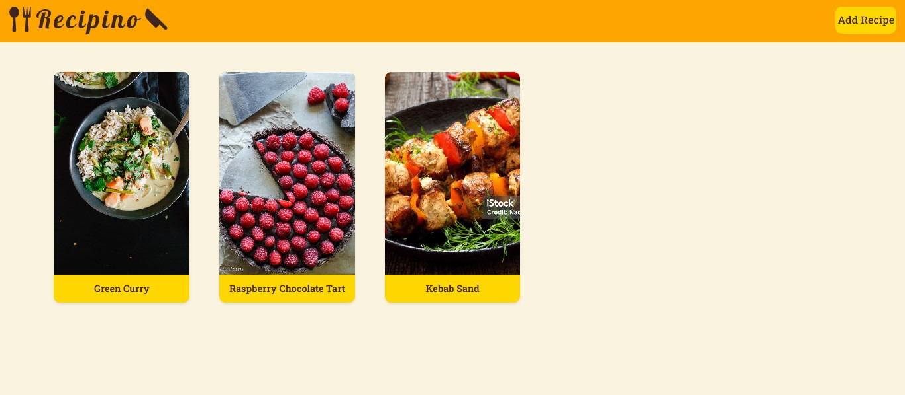

# Recipino

Recipino is a web application that allows users to create recipe.

## Features

**Add Recipes:** Users can add new recipes with titles, images, ingredients, and sources.

**Upload Images:** Users can upload images for their recipes to visualize each dish.

**List Ingredients:** Recipes display a list of ingredients required for easy preparation.

**Source Attribution:** Users can credit the source of each recipe.

**Delete Recipes:** Users can remove unwanted recipes from their collection.

**Responsive Design:** The app is accessible on different devices.

## Technologies Used

- HTML
- CSS/Sass
- Recat.js
- JavaScript
- Tailwind
- Vite

## Contact

feel free to reach out:

- **Email:** masoudrz99@gmail.com
- **LinkedIn:** linkedin.com/in/masoudrz
